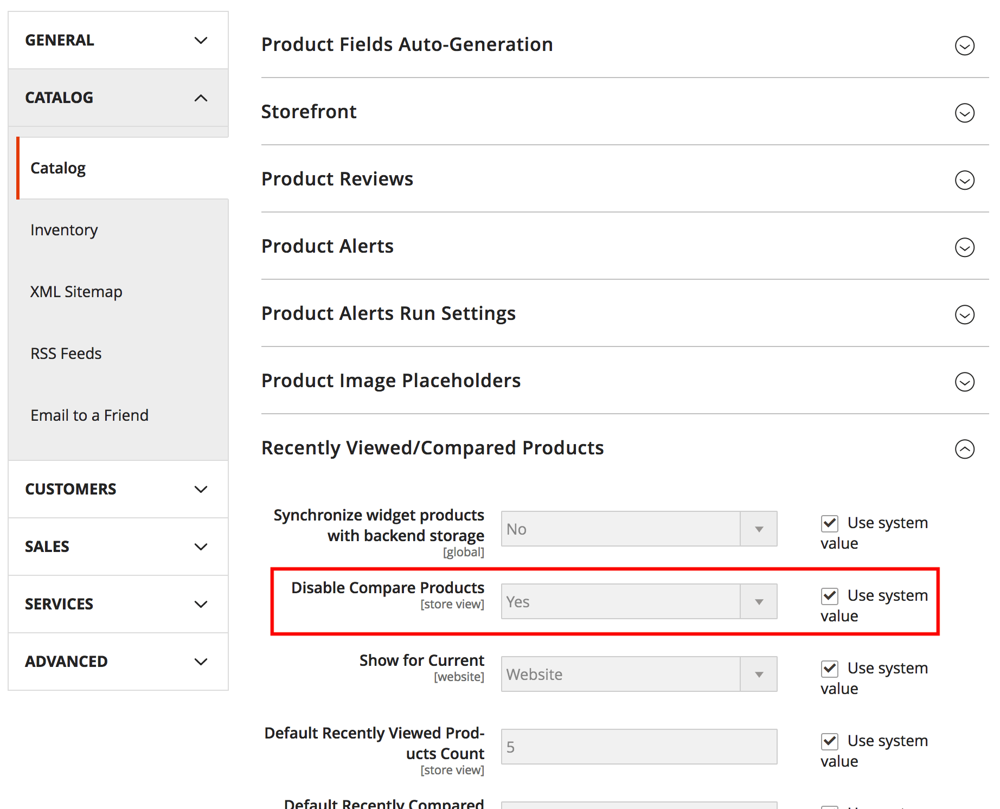

# Galactic Labs - Disable Compare Products

This simple module adds a new config value to the Catalog Recently Viewed/Compared Products admin section, allowing you to remove the compare products functionality.

It will remove product compare from:

* Category view sidebar
* Category view product list
* Product view
* Search results product list
* My account sidebar

## Installation

Require the module

```bash
composer require galacticlabs/disable-compare-products
```

Enable the module

```bash
php bin/magento module:enable GalacticLabs_DisableCompareProducts
```

Run setup to install module and set up table(s)

```bash
php bin/magento setup:upgrade
```

## Usage

Once installed, you can choose to disable the compare products functionality at `Stores > Settings > Configuration > Catalog > Catalog > Recently Viewed/Compared Products` then choosing yes or no from the new config option `Disable Compare Products`.

***Note: By default this option is set to no. Set it to yes and clear any caches to see the results.***



## How it works

Removing layout items is not trivial when doing so based on a config value. Therefore I have had to add an observer that adds a new layout handle `gl_remove_compare_products` to the page when the module config value is set to yes.
 
 This will have a small performance impact, so if performance is everything then use the traditional route of adding these handles manually to your theme.
 
 You can see the layout changes made in the `view/frontend/layout/gl_remove_compare_products.xml` file.
 
## Can you also disable the wishlist?
 
This is a native Magento 2 feature. Just go to `Stores > Settings > Configuration > Customers > Wishlist > General Options` and change `enabled` to no.

## Bugs/Feature Requests & Contribution

Please do open a pull request on GitHub should you want to contribute, or create an issue.

## License
[MIT](https://opensource.org/licenses/MIT) - Do as you wish 👍